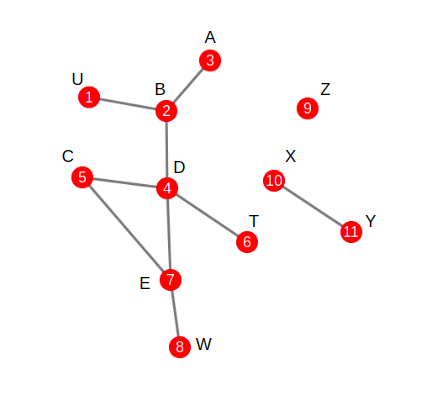

[DGraph]
======================
[DGraph]: https://github.com/maldonadoq/redes/tree/master/dgraph 
[comment]: [TOC]
- [Instalación](#instalación)
- [Código](#código)
- [Ejecución](#ejecución)
- [Comandos](#comandos)
- [Ejemplo](#ejemplo)
- [Red](#red)

### Instalación

Necesitamos librerías como SQLite, Boost y GCC-7

#### Requerimientos

```bash
$ sudo apt-get update
$ sudo apt-get install sqlite3
$ sudo apt-get install libsqlite3-dev
$ sudo apt-get install sqlitebrowser
$ sudo apt-get install libboost-all-dev
```

#### Compilación

```bash
$ cd folder name
$ mkdir db
$ make clean
$ make
```

### Código

En esta sección vemos la lógica del código

#### Cliente/Maestro

La parte del cliente y el maestro se encuentra juntos en una clase, lo realizamos así ya que el cliente solo recibe por consola la consulta y esta se la manda al maestro, decidimos juntaros por cuestiones de tiempo.

```c++
class TFront{
private:
	static int m_bits_size;
	static vector<TInfo> m_slaves;	// esclavos disponibles
	static TInfo m_info;			// info [puerto, ip]
	static TAddress m_conn;			// address [fd, addr]
	
    /*variables para realizar una consulta con profundidad*/
    static int m_deep;
	static int m_intermedium;
	static vector<pair<string, string> > result_deep;

    /*principales funciones*/
	static void talking();			// interfaz del cliente
	static void load_graph();		// carga un grafo de un txt
	static void query(string);		// realiza la consula
	static void listening();		// escucha las respuesta de los esclavos

	void init();			// inicializa el cliente [socket]
	void set_slaves();		// estático - dinámico
    void load_config();		// cargar configuraciones
	void save_config();		// guardar configuraciones de los esclavos
public:
	TFront();
	TFront(int, string);
	~TFront();

	void run();
};
```


#### Esclavo/SQLite

Esclavo

```c++
class TSlave{
private:
	int m_bits_size;
	TInfo m_info;		// info [port, ip]
	TAddress m_conn;	// address [fd, addr]
    TDatabase *m_db;	// SQLite Data Base

	void listening();
	void init();
public:
	TSlave();
	TSlave(int, string, string);
	~TSlave();

	void run();
};
```

Base de datos sqlite3 en cada esclavo

```c++
class TDatabase{
private:
	sqlite3* m_sqlite;
	string m_name;
public:	
	TDatabase(string);
	TDatabase();
	~TDatabase();
    
	bool execute(string); 
	bool execute(string, vector<vector<string> > &);
};
```

Al momento de crear un Esclavo, verificamos que no exista una base de datos ya cargada, si no se encuentra, se crea

```c++
TDatabase::TDatabase(string _name){
    this->m_name = _name;

	bool de = exists(m_name);

    int rq = 0; 
    rq = sqlite3_open(m_name.c_str(), &m_sqlite);

    if(rq){
        cerr << "Error Create Database " << sqlite3_errmsg(m_sqlite) << "\n";
    }
    else{
        if(de){
            cout << "Database Exists!\n";
        }
        else{
            cout << "Created Database Successfully!\n";
            string sql;
            sql = 	"CREATE TABLE NODE("
                        "ID 		INTEGER PRIMARY KEY AUTOINCREMENT, "
                        "NAME 		TEXT 	NOT NULL UNIQUE, "
                        "ATTRIBUTE 	TEXT"
                	");";
            execute(sql);

            sql = 	"CREATE TABLE RELATION("
                        "ID 		INTEGER PRIMARY KEY AUTOINCREMENT, "
                        "NAME1 		TEXT                NOT NULL, "
                        "NAME2 		TEXT                NOT NULL"
                    ");";
            execute(sql);
        }
    }
}
```

#### Protocolo

Desarrollamos una clase llamada Protocolo, que no es más que un parseador de una comunicación, envía en paquetes si la información si es mayor de lo que se puede enviar en un paquete, necesita el ip del destino y el numero de bits por paquete.

```c++
/*
	1 -> commando				|
	1 -> bool [body or head]	|
	2 -> size of message		|_	size = 4
*/

class TProtocol{
private:
	int m_bits_size;	// buffer size
	int m_bit;			/* example:
							1-9     -> 1
							10-99   -> 2
							100-999 -> 3
						*/

	vector<string> split_text(string);
public:
	TProtocol();
	TProtocol(int);
	~TProtocol();

	void sending(string, int, string);
	string receiving(int);
};
```

#### Main

Cliente/Maestro

```c++
int main(int argc, char const *argv[]){

	int port = 6666;
	string ip = "127.0.0.1";

	if(argc == 3){
		port = stoi(argv[1]);
		ip = argv[2];
	}

	TFront *cl = new TFront(port, ip);

	cl->run();

	delete cl;
	return 0;
}
```

Esclavo/SQLite

```c++
int main(int argc, char const *argv[]){
	int port = 8000;
	string ip = "127.0.0.1";
	string db = "db/slave.db";

	if(argc == 4){
		port = stoi(argv[1]);
		ip = argv[2];
		db = "db/" + string(argv[3]);
	}

	TSlave *sr = new TSlave(port, ip, db);

	sr->run();

	delete sr;
	return 0;
}
```

### Ejecución

Tenemos dos modos de ejecución, estático y dinámico. Se puede cambiar esto en la parte del cliente, ya que si es estático, solo se cargan dos esclavos, si deseamos añadir n esclavos, necesitamos la parte dinámica, que en si es un bucle que te pide información de cuantos esclavos quieres, y te pide el puerto y la ip de estas.

#### Estático

##### Esclavo/SQLite

```bash
$ # ./slave.out port ip db-name
$ ./slave.out 8000 127.0.0.1 slave1.db
  Created Database Successfully!
  --------
$ ./slave.out 8004 127.0.0.1 slave2.db
  Created Database Successfully!
```
##### Cliente/Maestro
```c++
void TFront::set_slaves(){
	/*Dinamico*/

    /*Estático*/
	m_slaves.push_back({8000, "127.0.0.1"});
	m_slaves.push_back({8004, "127.0.0.1"});
}
```

Ejecutar

```bash
$ # ./front.out port ip
$ ./front.out 6666 127.0.0.1
  sarah: 
```

#### Dinámico

Podemos ejecutar y añadir con N esclavos.

##### Esclavo/SQLite

```bash
# N = 5
$ ./slave.out 8000 127.0.0.1 slave1.db
  Created Database Successfully!  
  --------
$ ./slave.out 8004 127.0.0.1 slave2.db
  Created Database Successfully!
  --------
$ ./slave.out 8008 127.0.0.1 slave3.db
  Created Database Successfully!
  --------
$ ./slave.out 8012 127.0.0.1 slave4.db
  Created Database Successfully!
  --------
$ ./slave.out 8016 127.0.0.1 slave5.db
  Created Database Successfully!
```

##### Cliente/Maestro

```c++
void TFront::set_slaves(){
	/*Dinamico*/
	bool ce = util_exists("db/config.txt");

	if(ce){
		cout << "Loading config\n";
		load_config();
	}
	else{
		int ns;
		cout << "Slaves Number: "; cin >> ns;

		int port;
		string ip;
		for(int i=0; i<ns; i++){
			cout << "  Slave " << i+1 << "\n";
			cout << "    Port: "; cin >> port;
			cout << "    Ip: "; cin >> ip;
			cout << "\n";

			m_slaves.push_back({port, ip});
		}
		save_config();
	}
    
    /*Estático*/
}
```
Ejecutar
```bash
$ # ./front.out port ip
$ ./front.out 6666 127.0.0.1
  Slaves Number: 5
  Slave 1
    Port: 8000 
    Ip: 127.0.0.1

  Slave 2
    Port: 8004
    Ip: 127.0.0.1

  ........

  Slave 5
    Port: 8016
    Ip: 127.0.0.1

```

### Comandos

#### Insertar

Insertar un nodo [R]

```bash
  sarah: I N Nodo Value
```

Insertar una relación nodo-nodo [R]

```bash
  sarah: I R Nodo1 Nodo2
```

#### Selección

Extraer todo los nodos existentes

```bash
  sarah: A N
```
Extraer todo las relaciones existentes

```bash
  sarah: A R
```

Extraer información de un nodo en especifico

```bash
  sarah: Q N Nodo
```

Extraer las relaciones de un nodo

```bash
  sarah: Q R Nodo
```

Extraer las relaciones de un nodo con una profundidad N [Entero]

```
  sarah: Q R Nodo N
```

#### Actualizar

Actualizar el atributo de un nodo

```bash
  sarah: U N Nodo Value
```

Actualizar una relación Nodo1 - Nodo2  a Nodo1 - Nodo3

```bash
  sarah: U R Nodo1 Nodo2 Nodo3
```

#### Borrar

Borrar un nodo y sus relaciones

```bash
  sarah: D N Nodo
```

Borrar una relación entre 2 nodos
```bash
  sarah: D R Nodo1 Nodo2
```

#### Salir

```bash
  sarah: exit
  sarah: Exit
  sarah: q
```

### Ejemplo

#### Grafo


Grafo simple generado para prueba

#### Dinámico

Cargaremos el grafo de la imagen a través de nuestro cliente.

##### Cliente
Debemos de tener en la carpeta db el archivo test.txt con los siguientes valores.

```
I N U 1
I N B 2
I N A 3
I N D 4
I N C 5
I N T 6
I N E 7
I N W 8
I N Z 9
I N X 10
I N Y 11
I R U B
I R B A
I R B D
I R D C
I R D T
I R D E
I R C E
I R E W
I R X Y
```

Crearemos 4 esclavos de manera local, todos con la misma ip 127.0.0.1 y con puertos 8000, 8004, 8008 y 8012 respectivamente, en 4 consolas distintas.

```bash
$ ./slave.out 8000 127.0.0.1 slave1.db
$ ./slave.out 8004 127.0.0.1 slave2.db
$ ./slave.out 8008 127.0.0.1 slave3.db
$ ./slave.out 8012 127.0.0.1 slave4.db
```

Ejecutamos el cliente, la primera vez nos pedirá ingresar el número de esclavos disponibles, llenamos la información correspondiente. De ahí podemos ingresar los comandos diseñados y explicados previamente.

```bash
$ ./front.out 6666 127.0.0.1
```

Cargamos el grafo del archivo db/test.txt

```bash
  sarah: load		# carga el grafo
  sarah: A N		# consulta de los nodos existentes
  sarah: A R		# consulta de las relaciones existentes
  sarah: Q N A		# consulta de un nodo especifico
  sarah: Q R A		# consulta las relaciónes del nodo A con profundidad 1
  sarah: Q R A 4	# consulta las relaciónes del nodo A con profundidad 4
  sarah: I N H 10	# inserta un nodo nuevo H con atributo 10
  sarah: I N G 100	# inserta un nodo nuevo G con atributo 100
  sarah: I R H G	# inserta una relación entre H y G
  sarah: Q R X 3	# consulta las relaciónes del nodo X con profundidad 3 
  sarah: I R Y H	# inserta una relación entre Y y H
  sarah: Q R X 3	# consulta las relaciónes del nodo X con profundidad 3 
  sarah: Q R A 4 	# consulta las relaciónes del nodo A con profundidad 4
  sarah: D R A B	# borra la relación entre los nodos A y B
  sarah: Q R A 4	# consulta las relaciónes del nodo A con profundidad 4
  sarah: U N A UCSP	# actualiza el atributo del nodo A con UCSP
  
  sarah: D N A		# borra nodo A
  					# falta completar, borra las relaciones salientes de A
  					# pero no las entrantes hacia A
  sarah: Q N A		# consulta de un nodo especifico
  sarah: Q R A		# consulta las relaciónes del nodo A con profundidad 1
  sarah: Q R B		# consulta las relaciónes del nodo B con profundidad 1
  
  # para eliminar un nodo y sus relaciones, podemos hacerlo manualmente
  sarah: Q R A
  sarah: D R A X	# X = cada uno de los resultados de la consulta anterior.
  sarah: D N A 		# borra el nodo A, luego de haber borrado sus relaciones
  sarah: q			# salimos del programa
```
* * *

### Red

Si deseamos correr este programa de manera distribuida, y en distintas maquinas, necesitamos estar conectados en una misma red, cada maquina tiene sus propias ip's, con eso asignar al momento de ejecutar la ip del cliente y los esclavos es clave.

[Percy Maldonado Quispe UCSP](https://github.com/maldonadoq)
